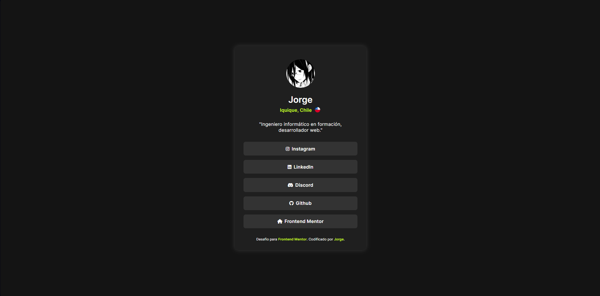
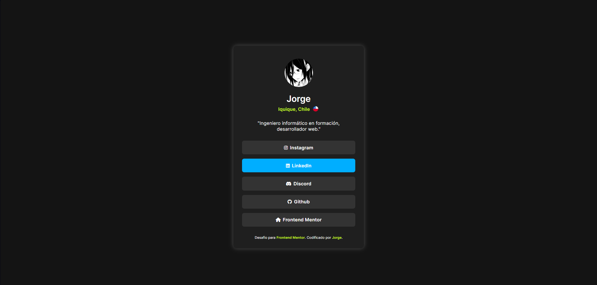

# Tarjeta de presentación: Perfil de Redes Sociales

En este proyecto diseñé una tarjeta con Información sobre redes sociales utilizadas con frecuencia.

## Contenidos

- [Previsualización](#previsualización)
  - [Screenshot](#screenshot)
  - [Links](#links)
- [Proceso](#proceso)
  - [Hecho con](#hecho-con)

## Previsualización

### Screenshot

### Links

- Sitio: [Tarjeta de Presentación de Redes Sociales](https://f-avalos.github.io/Profile-Card/)

## Proceso

### Hecho con

- HTML
- CSS
- Flexbox